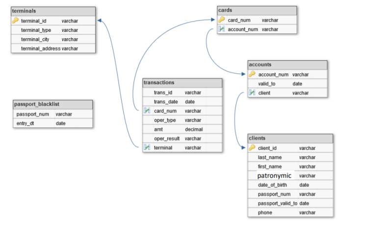

# ETL-process

ETL and OLAP Schematic:

scheme of data warehouse and staging area (actually tables have additional fields due to SCD1):

### Executing main.py:
Tables in SCD1 form, update insert and delete pull ups from source to staging then to data warehouse after ETL, system builds required reports (data mart)

